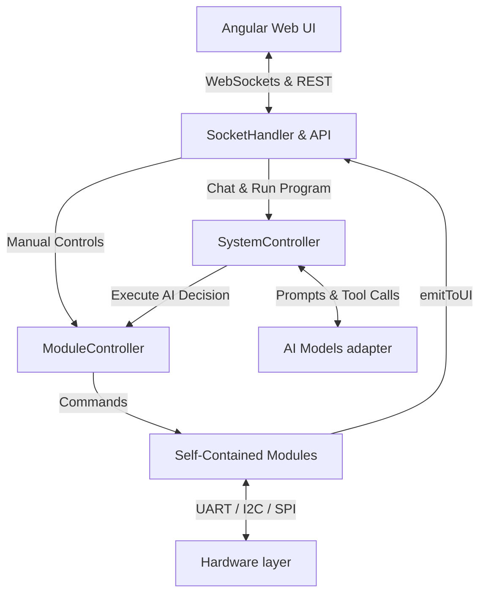

# Open V Robotics System

[](https://github.com/ellerbrock/open-source-badges/)
[](http://makeapullrequest.com)

## Open V Robotics System

The Open V Robotics System is a modular, open-source platform and architectural framework for building autonomous AI robots of any complexity.

The goal of the project is to provide developers and engineers with a reliable, production-ready foundation. The platform offers a seamless bridge between low-level microcontrollers, high-level AI, and a user-friendly web interface. You can take this code, 3D print your own chassis, connect the specific sensors you need, and build a smart machine tailored to your unique tasks.

## The "Programs" System (Core Feature)

The flagship feature of Open V Robotics System is its dynamic configuration management system, known as **"Programs."** Right from the web interface, you can create isolated behavior profiles for your robot.

Each Program includes:

* **AI Model Selection:** Assigning a specific engine (Cloud AI or a local model).
* **System Prompt:** Setting the persona and global objectives (e.g., *"You are a friendly companion"* or *"You are an agricultural assistant, perform tasks dryly and accurately"*).
* **Module Permissions:** Flexible control over robot capabilities. You can programmatically disable physical hardware (e.g., chassis drive motors, distance sensors) or virtual modules (e.g., external web APIs, media players) for any specific program.
* **Instant Switching:** Switching between programs happens "on the fly," completely changing the AI's operating context and its hardware access without rebooting the system.

## System Architecture

The system is intentionally divided into isolated layers to prevent bottlenecks and allow for effortless hardware scaling.

### 1. High-Level (Brain / Compute Center)
*Responsible for intelligence, decision-making, context retention, and user communication.*

* **Foundation (SBC):** Can run on a Raspberry Pi 5, AI computers like the Nvidia Jetson Orin Nano Super, or any other powerful single-board computer.
* **Backend Core:** Written in TypeScript / Node.js. Acts as the central hub, routing all data streams.
* **AI Adapter Layer:** The platform is agnostic and not tied to a single neural network. You can utilize **Cloud AI** (cloud APIs like Gemini Live) for a quick start and a broad knowledge base. Alternatively, you can deploy **Local Edge AI** (local models, fine-tuned for your specific business tasks) for offline operation, maximum privacy, and zero latency.
* **Vision and Audio:** Connected directly to the main compute unit is an Arducam Camera Module V3 with autofocus for object recognition, alongside a hardware I2S bus for high-quality audio transmission (microphone and stereo speakers).
* **User Interface (UI):** A fully-featured web application built with Angular (PWA). Communication with the core is instantaneous via WebSockets (handling telemetry and real-time manual command overrides).
* **Configuration System:** Settings are stored in a lightweight local SQLite database (using a clean key/value structure with Zod validators).

### 2. Low-Level (Spinal Cord / Hardware Controller)
*Responsible for strict, real-time control of the physical world.*

* **Foundation:** Microcontroller (Raspberry Pi Pico by default).

> **Why not run everything on the Raspberry Pi 5?**
> Linux-based operating systems are not Real-Time Operating Systems (RTOS). Background processes and the task scheduler introduce unpredictable micro-delays (jitter). Driving motors or reading sensors directly from an RPi 5 results in jerky movements and timing failures. A microcontroller (Pico) solves this: it operates in strict real-time, ensuring perfectly smooth PID control and hardware safety, while the upper level handles the heavy logic.

### 3. Transport Layer (Communication)
Communication between layers is handled via hardware UART. For maximum parsing speed, a flat JSON protocol is used:

```json
{"m": "drive", "a": "move", "v": 300, "s": 100}
```
*(where: `m` - module, `a` - action, `v` - value/distance, `s` - speed)*

### 4. Software Data Flow & Architecture

Internally, the `server` (Node.js backend) separates responsibilities into distinct layers to ensure that AI capabilities, low-level hardware control, and user interactions are perfectly decoupled.



#### Core Components Overview:
1. **SystemController (The Orchestrator):** The brain of the Node.js app. It loads the active "Program", enforces module permissions, instantiates the correct `AIController`, and routes user audio/text directly to the AI model.
2. **AIController (The Adapter):** An abstraction layer that wraps different networks (Gemini, DeepSeek, etc.). It translates the platform's standardized AI tools into the specific JSON schema required by the vendor, and parses the model's function calls back into standard commands.
3. **ModuleController (The Bridge):** Executes actions. When the `SystemController` receives a function call from the AI like `drive_moveDistance`, or the user presses a button on the UI, it goes to the `ModuleController`. This controller instantly finds the corresponding module and executes the logic.
4. **Modules (The Extensibility Layer):** Modules are self-contained. They hold the business logic. A module can talk to external web APIs (like an Image Generator), or it can use the `PicoConnector` to send flat JSON over UART down to the Raspberry Pi Pico to spin a physical motor. A module can also trigger an `emitToUI()` event, which pushes dynamic data directly back to the Angular screen over WebSockets.

---

### 5. Platform Extensibility (The Module System)

The Open V Robotics System is designed as a "plug-and-play" platform. Everything the robot interacts with—physical hardware (sensors, motors), media components (screens, cameras), or software services (AI generators, external APIs)—are encapsulated as **Modules**.

The architecture uses a "Self-Contained Module" pattern. This means all logic, AI tool declarations, UI permissions, and required API keys for a specific feature live in a **single file**.

Adding a new capability to the robot (e.g., a Weather Forecaster) requires only two simple steps:

#### Step 1: Create the Module File
Create a new file in the `server/src/modules/` directory (e.g., `weather-service.ts`). The module must export a `defineModule()` definition.

```typescript
import { defineModule, IModuleDeps } from '../types/module.js';

export default defineModule({
  id: 'weatherService',
  name: 'Weather Forecaster',
  description: 'Fetches real-time weather data and displays animations on the screen.',
  category: 'service', // Categories: 'sensor', 'actuator', 'media', 'service'
  
  // Settings automatically exposed to the UI (Settings Page)
  moduleConfigs: [
    { 
      key: 'openweathermap_api_key', 
      label: 'OpenWeather API Key', 
      hint: 'openweathermap.org / API Keys',
      type: 'text'
    },
    {
      key: 'weather_refresh_rate',
      label: 'Update Frequency (minutes)',
      type: 'range',
      min: 5,
      max: 60
    }
  ],
  
  // AI capabilities automatically registered with the selected LLM
  getTools: () => [
    {
      module: 'weatherService',
      name: 'weatherService_getWeather',
      description: 'Get current weather conditions for a specific city.',
      parameters: [{ name: 'city', type: 'string', isRequired: true }]
    }
  ],

  // Factory method called by the ModuleController
  create(deps: IModuleDeps) {
    return new WeatherServiceModule(deps);
  }
});

class WeatherServiceModule {
  constructor(private deps: IModuleDeps) {}

  async getWeather({ city }: { city: string }) {
    // 1. Get user configuration
    const apiKey = this.deps.getConfig('openweathermap_api_key');
    
    // 2. Perform module logic (e.g., call external API)
    const url = `https://api.openweathermap.org/data/2.5/weather?q=${city}&appid=${apiKey}`;
    const response = await fetch(url).then(res => res.json());
    
    // 3. Send a command symmetrically back to the Angular UI Web App!
    // The UI module component will receive this command and render a 3D animation
    this.deps.emitToUI('showWeatherAnimation', { condition: response.weather[0].main });
    
    // 4. Return text back to the AI
    return `The weather in ${city} is ${response.weather[0].description} with a temperature of ${response.main.temp}K.`;
  }
}
```

#### Step 2: Register the Module
Add the module to the central registry in `server/src/modules/module-registry.ts`:

```typescript
import weatherService from './weather-service.js';

export const moduleRegistry: IModuleDefinition[] = [
  // ... existing modules
  weatherService,
];
```

**That's it!** The system automatically:
1. Provisions the new configuration fields in the Web UI Settings page.
2. Adds the module to the Program Editor (under the `SMART SERVICES` category) so you can grant or revoke AI access.
3. Maps the AI tools, parses the JSON tool-calls, and routes the commands seamlessly to your class methods.
4. Bridges symmetric communication (`emitToUI`), allowing your module to push data (like maps or generated images) directly to the Angular frontend.

## Use Cases

The Open V Robotics System is a blank slate. Here are just a few examples of what you can turn this system into:

* **Home Companion:** Train a local model on your daily habits. The robot can recognize family members by face, remind you of important tasks, and control your smart home devices via Zigbee/Wi-Fi.
* **AI Friend & Tutor for Children:** Leveraging the camera and audio system, the robot becomes an interactive teacher. It can help with homework, teach languages through play, recognize objects the child holds up, and serve as a safe, empathetic conversational partner.
* **Autonomous Agricultural UGV (Unmanned Ground Vehicle):** Remove the audio modules for dirt and water resistance. Create a program with access to a manipulator arm and camera. Load a local AI model fine-tuned for weed recognition, and the rover can autonomously maintain greenhouses.
* **Security Platform:** Integrate thermal imagers. The robot can conduct night perimeter patrols and trigger Webhook notifications to your server upon detecting motion.

## Hardware

#TBD

---

## Software Installation Guide

Follow these steps to set up the Open V Robotics System from scratch on a new Raspberry Pi 5.

### 1. Raspberry Pi OS Setup
Download the **Raspberry Pi Imager** from the [official web page](https://www.raspberrypi.com/software/).
> **Tip:** We highly recommend enabling SSH in the imager settings before flashing the OS.

**Disable On-Screen Keyboard:**
If using a touchscreen, turn off the digital keyboard:
Navigate to: `Menu -> Preferences -> Control Centre -> Display -> On-screen Keyboard` and change it to **Disabled**.

**Enable Serial Interfaces:**
Navigate to: `Menu -> Preferences -> Control Centre -> Interfaces -> Serial Port` and toggle it **On**.

### 2. Camera and I2S Audio Module Setup
Open the boot configuration file to enable the camera and sound card:
```bash
sudo nano /boot/firmware/config.txt
```

Find the line: `camera_auto_detect=1`, and update it to: `camera_auto_detect=0`

Add the following to the very end of the file:
```ini
[all]
dtoverlay=imx708,cam0
dtparam=i2s=on
dtoverlay=googlevoicehat-soundcard
```

Save the file and reboot the system:
```bash
sudo reboot
```

*(Optional) Test Camera:*
You can test the camera now or wait to test it in the web interface later:
```bash
rpicam-still -t 0
```

### 3. Audio Setup (PipeWire)
PipeWire manages audio directly through hardware. Since the ICS-43434 (and all I2S MEMS mics) have very low output, PipeWire's soft-mixer handles the necessary volume boost.

**Verify PipeWire and WirePlumber:**
```bash
systemctl --user status pipewire
systemctl --user status wireplumber
```
Both should show `active (running)`. If not, enable them:
```bash
systemctl --user enable --now pipewire wireplumber
```

**Check Audio Devices:**
```bash
wpctl status
```
Look for your I2S card (`googlevoicehat-soundcard`) in both Sources (microphone) and Sinks (speaker). Note the IDs, you will need them.

**Set Volumes:**
Replace `<source_id>` and `<sink_id>` with the ID numbers from the previous step.
```bash
wpctl set-volume <source_id> 8.0
wpctl set-volume <sink_id> 1.0
```
Save and restart WirePlumber:
```bash
systemctl --user restart wireplumber
```

**Test Microphone:**
Record for 5 seconds, then press `Ctrl+C`:
```bash
pw-record --format=s16 --rate=16000 --channels=1 test_mic.wav
```
Play back the recording:
```bash
pw-play test_mic.wav
```

### 4. Noise & Echo Cancellation
We use WebRTC AEC module to cancel out speaker noise from the microphone.
Create a new configuration file:
```bash
nano ~/.config/pipewire/pipewire.conf.d/20-webrtc-aec.conf
```
Insert the following parameters:
```conf
context.modules = [
    {   name = libpipewire-module-echo-cancel
        args = {
            library.name  = aec/libspa-aec-webrtc

            aec.args = {
                webrtc.echo_cancellation = true
                webrtc.noise_suppression = true
                webrtc.gain_control = true
                webrtc.extended_filter = true
            }

            source.props = {
                node.name = "robot_echo_cancel_source"
                node.description = "Mic with AEC and Noise Suppression"
            }

            sink.props = {
                node.name = "robot_echo_cancel_sink"
                node.description = "Speaker for Echo Reference"
            }
        }
    }
]
```
Restart all audio services to apply:
```bash
systemctl --user restart pipewire pipewire-pulse wireplumber
```

---

### 5. Flashing the Firmware (OpenOCD)
To flash the Pico directly from the Pi 5's GPIO pins, compile OpenOCD:

```bash
sudo apt update
sudo apt install -y g++ make cmake libtool pkg-config libusb-1.0-0-dev libhidapi-dev libftdi-dev libpcap-dev libgpiod-dev libjim-dev

cd ~
git clone https://github.com/raspberrypi/openocd.git --recursive --depth=1
cd openocd
./bootstrap
./configure --enable-linuxgpiod --enable-sysfsgpio --enable-bcm2835gpio
make -j4
sudo make install
```

### 6. Clone & Compile Open V System
Clone the project repository:
```bash
cd ~
git clone https://github.com/vahagnmikayelyan/open-v-robotics-system
```

*(Optional) Test OpenOCD Connection:*
```bash
cd ~/open-v-robotics-system
openocd -f rpi5-pico-swd.cfg
```

**Prepare MicroPython:**
```bash
cd ~/open-v-robotics-system
git clone --recursive https://github.com/micropython/micropython.git
sudo apt install -y build-essential cmake gcc-arm-none-eabi libnewlib-arm-none-eabi libstdc++-arm-none-eabi-newlib
```

**Compile MicroPython Tools (`mpy-cross`):**
*(Note: mpy-cross is used to compile `.py` scripts into lightweight `.mpy` bytecode so it can be "frozen" directly into the firmware, saving significant RAM on the Pico!)*
```bash
cd ~/open-v-robotics-system/micropython/mpy-cross
make clean
make -j4
```

**Build and Flash the Pico Firmware:**
```bash
cd ~/open-v-robotics-system
chmod +x build-and-deploy.sh
./build-and-deploy.sh
```

---

### 7. Web UI and Server 
Install the Node.js runtime and compile the frontend and backend.
```bash
curl -fsSL https://deb.nodesource.com/setup_lts.x | sudo -E bash -
sudo apt-get install -y nodejs
```

**Install Dependencies & Build Projects:**
```bash
# Build the backend server
cd ~/open-v-robotics-system/server
npm i
npm run build

# Build the Angular web UI
cd ~/open-v-robotics-system/web
npm i
npm run build
```

**Setup PM2 (Daemon Process Manager):**
PM2 ensures the server runs in the background and restarts automatically on crash or boot.
```bash
sudo npm install -g pm2

cd ~
pm2 start open-v-robotics-system/pm2/ecosystem.config.js
pm2 save
pm2 startup
```
> **Important:** Copy and paste the command generated by `pm2 startup` into your terminal to finalize the setup.

#### Helpful PM2 Commands
| Command | Action |
|---|---|
| `pm2 logs open-v-robotics-system` | View live trailing logs of the server |
| `pm2 logs --err` | View only error logs |
| `pm2 flush` | Clear the log history |
| `pm2 restart all` | Force restart the backend |


## Enabling Kiosk Mode

Kiosk mode launches Chromium in full-screen on boot, pointed at the local server — no taskbar, no cursor, no browser chrome.

> This setup was tested on **Raspberry Pi 5** running **Debian GNU/Linux 13 (trixie)** with **LightDM** display manager and **labwc** Wayland compositor (the default Raspberry Pi OS desktop stack).

### Prerequisites

Chromium is pre-installed on Raspberry Pi OS. Verify it is present:

```bash
which chromium
# Expected: /usr/bin/chromium
```

> **Note:** Raspberry Pi OS enables desktop auto-login by default — no configuration needed.

### 1. Configure labwc Autostart

labwc reads `~/.config/labwc/autostart` on session start. Edit or create it:

```bash
nano ~/.config/labwc/autostart
```

Paste the following content:

```bash
# Prevent display from going blank or sleeping
wlopm --on HDMI-A-1 2>/dev/null || true

# Wait for PM2 Node.js server to be ready on port 3000
sleep 8

# Launch Chromium in kiosk mode (Wayland native)
/usr/bin/chromium \
  --noerrdialogs \
  --disable-infobars \
  --kiosk \
  --no-first-run \
  --disable-session-crashed-bubble \
  --disable-restore-session-state \
  --ozone-platform=wayland \
  --enable-features=OverlayScrollbar \
  --disable-pinch \
  --overscroll-history-navigation=0 \
  --autoplay-policy=no-user-gesture-required \
  --disable-sync \
  --password-store=basic \
  --use-mock-keychain \
  --no-default-browser-check \
  --disable-features=PasswordLeakDetection \
  http://localhost:3000 &
```

Save and close (`Ctrl + O`, `Enter`, `Ctrl + X`).

> **Why these flags?**
> - `--ozone-platform=wayland` — runs Chromium natively under Wayland (no XWayland)
> - `--disable-sync`, `--password-store=basic`, `--use-mock-keychain` — suppresses the Chrome password pairing/keyring dialog on first launch
> - `--disable-pinch`, `--overscroll-history-navigation=0` — prevents accidental swipe navigation on touchscreens
> - `sleep 8` — gives PM2 time to fully start the Node.js server before Chromium opens

### 2. Reboot

```bash
sudo reboot
```

> **Tip:** To exit kiosk mode temporarily, press `Alt + F4` to close Chromium.