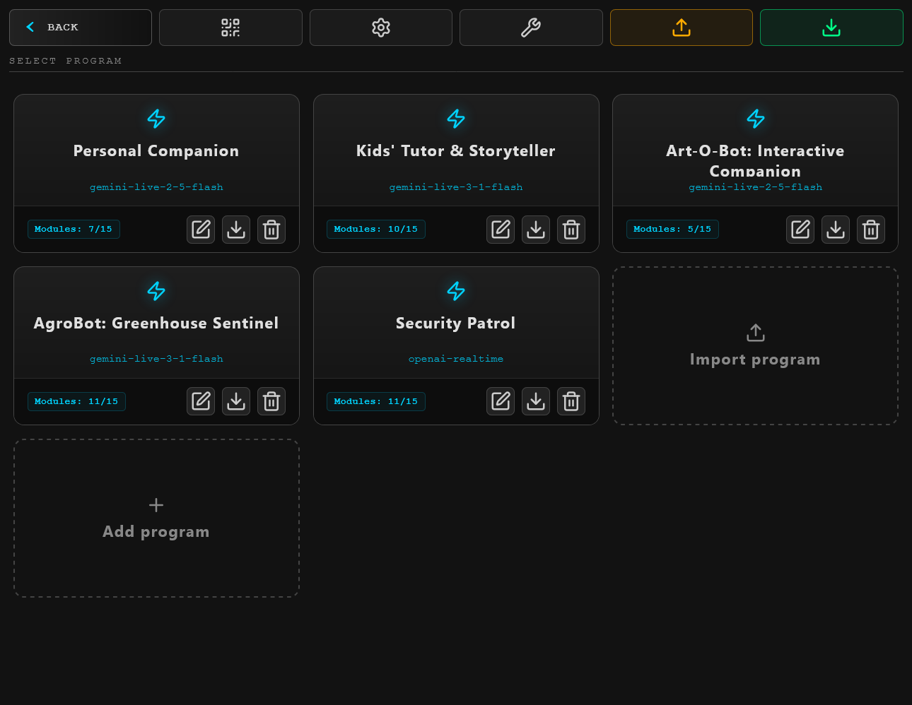
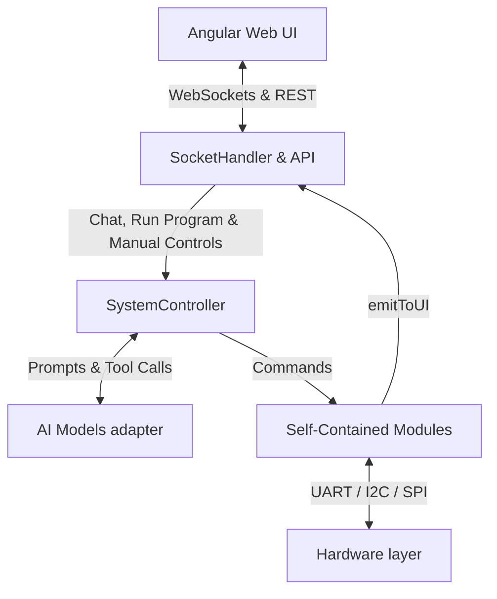

# Open V Robotics System

[](https://github.com/ellerbrock/open-source-badges/)
[](http://makeapullrequest.com)

The **Open V Robotics System** is a software-first orchestration platform, operating framework, and developer environment for building **embodied physical AI Agents** (AI Agents with a physical body) of any complexity. 

Rather than a static blueprint for a single specific robot, the **Open V Robotics System** is a highly adaptable operating framework. It provides a production-ready, decoupled bridge connecting high-level cognitive AI (large language models, cloud real-time adapters), low-level real-time microcontrollers, and a sleek, interactive web interface.

With the **Open V Robotics System**, the hardware is simply a physical extension of the software. You can take any chassis (wheeled, tracked, or static), connect your custom sensors and actuators, write modular drivers, and instantly instantiate diverse, safe AI personalities with custom physical and digital capabilities.

---

## The Core Concept: Software-First Cognitive Profiles ("Programs")

The heart of the **Open V Robotics System** is the **"Programs" System**. A single machine can hold multiple programs simultaneously, each designed for entirely different environments, tasks, or audiences:
* **The Cognitive Brain:** In a program, you choose the underlying AI model (e.g., Gemini 3.5 Flash, OpenAI Realtime) and select the voice for the AI model.
* **The Behavioral Mind (System Instruction):** You write a comprehensive system prompt defining how the agent behaves, speaks, and acts.
* **The Physical & Digital Scope (Modules Access):** You explicitly toggle which capabilities the AI has access to. A module can be a hardware peripheral (camera, mic, motors, thermal sensors) or a software API (e.g., Fal.ai for image generation, a Poll module for interactive quizzes).
* **Decoupled Security & Tool Isolation:** Swapping active programs "on the fly" re-allocates hardware permissions and tool declarations instantly. If a program disables drive motors, the core `SystemController` physically isolates that module—meaning even if the AI model tries to make a function call to move, the request is intercepted and denied at the software gateway.

---

## Web control

Explore the highly responsive web interface custom-tailored for robot touchscreens, mobile phones, and tablets:

### 1. Main Screen (The Face & Dynamic Stage of the Agent)


The main screen is the Control Panel (accessible locally on the robot's display or remotely from any network-connected device).

The top header of the screen houses critical system-level control widgets in a clean, high-premium status bar:
* **Active Program Status:** Shows the name of the currently running program (or "No program running" when stopped).
* **Execution Stop Button:** A fast-action stop button to instantly halt the running program profile.
* **Volume Controls:** Speaker volume control panel.
* **Power Controls:** Reboot and power off.

Below the header is the active face area. When in standby mode, it acts as a digital "face" with animated eyes expressing presence and focus. Symmetrical design and custom animations allow the robot to convey feelings (e.g. happiness, curiosity, attention) using the Expression Controller, helping establish an empathetic connection with the user.

<table width="100%">
  <tr>
    <td width="50%"></td>
    <td width="50%"></td>
  </tr>
</table>

Beyond static expressions and eye movements, the main screen acts as a **dynamic rendering stage** that can show rich visual content controlled directly by active modules. For instance, the **Poll module** can generate and display questions and multiple-choice answer buttons directly on screen. In essence, each module can create its own unique visual experiences utilizing the platform's rich UI rendering capabilities (such as displaying full-screen generated paintings via the Fal AI module, rendering maps, or flashing sensory alerts).

---

### 2. Main Menu and Programs List



This main menu serves as the central control panel for selecting the active behavior program of the robot. From this menu, users can view all created programs, quickly swap the running program "on the fly" without rebooting the hardware, and monitor which services are active. Each program card displays the enabled AI model, allowed modules count, and features fast controls to edit, export, or delete the program. Furthermore, the main menu supports program operations, enabling developers to easily export a single program or all saved programs as JSON files, and import them for rapid distribution.

---

### 3. Program add/edit

<table width="100%">
  <tr>
    <td width="50%"></td>
    <td width="50%"></td>
  </tr>
</table>

The Program Editor is the primary configuration workspace where users define their AI agent's personality, intelligence model, and hardware access boundaries. It allows setting the global system instructions (the prompt defining the agent's behavior, style, and goals), choosing the underlying LLM engine (e.g., Gemini Flash, OpenAI Realtime), and selecting the voice for the AI model. 

Crucially, the editor manages module permissions: turning a module ON grants the AI permission to access its capabilities, while turning a module OFF completely isolates it. Furthermore, any module that requires program-specific adjustments exposes its configurations (`programConfigs`) directly inside the editor, allowing the user to configure module-specific parameters specifically for the current program.

---

### 4. System Settings


The System Settings page is the configuration panel for global, system-wide variables that apply across all programs. It manages the robot's default general parameters, such as the system name used in AI tool calls and a safety global speed limit slider that limits the motor controller's absolute maximum output. In addition, the settings page consolidates global module configurations (`moduleConfigs`), automatically displaying custom input controls for any registered module that defines its own global settings.

---

### 5. Dev mode

<table width="100%">
  <tr>
    <td width="33.3%"></td>
    <td width="33.3%"></td>
    <td width="33.3%"></td>
  </tr>
</table>

Developer Mode is a comprehensive diagnostic console designed for debugging, hardware calibration, driver development, and real-time telemetry testing. 

The left panel offers **manual controls and testing of existing modules** (such as overriding motor controls and fan speeds, switching headlights, rotating head servos, capturing camera stream previews, and triggering microphone or speaker audio playback tests).

The right panel features an **interactive chat and debug console**: it displays incoming sensor readings in real-time, system alerts, and system messages from the active AI agent, along with a terminal input field to send direct text messages to the AI model of the running program.

---

### 6. QR Remote Connection


The QR Quick Connect modal provides rapid remote access to the robot's control system. The web application dynamically generates a QR code on the robot's main display that users can scan using any smartphone or tablet connected to the same network. This opens the responsive Web UI instantly on the remote device without needing to type or search for the robot's local IP address, making manual remote override or profile editing extremely accessible.

---

## Use Cases: One Core Stack, Infinite Physical Realities

Because the **Open V Robotics System** treats capabilities as modular blocks, the exact same software stack fits vastly different physical realities:
* **A Headless Garden Sentinel:** An agricultural robot patrolling greenhouse crops. It uses distance sensors, light sensors, thermal scanners, and a robotic manipulator arm. Since it is built for a farmer, it has **no screen**—the AI processes environmental telemetry, makes local crop judgments, and controls the arm.
* **An Interactive STEM Tutor:** An educational companion for children. It runs in a chassis with a touchscreen, speaker, and microphone. It tells stories, generates visual illustrations via the Fal.ai API, reacts with cute facial emotions, and conducts multiple-choice math quizzes using the Poll module on the screen.
* **An R&D / Prototyping Sandbox:** A complete pre-engineered developer playground. If you are developing a new AI-robotic feature, you do not need to write WebSockets, real-time audio mixers, camera streaming, local SQLite repositories, or UART communication from scratch—all of this plumbing is already done. You simply focus on writing your specific module driver and test it instantly.

---

## System Architecture

The platform is intentionally divided into isolated layers to guarantee low latency, strict hardware timing, and effortless physical scaling.

### 1. High-Level (Brain / Compute Center)
*Runs on an SBC (Raspberry Pi 5, Orange Pi, NVIDIA Jetson). Handles intelligence, sensory inputs, and user interfaces.*
* **Backend Core (Node.js / TypeScript):** The central hub managing data routes, WebSockets, and SQLite configurations.
* **AI Adapter Layer:** Platform-agnostic LLM client. Supports cloud AI (e.g. Gemini Live, OpenAI Realtime) cloud services seamlessly.
* **Web UI (Angular PWA):** The responsive dashboard shown on the robot's display (Kiosk Mode) or remote control devices.

### 2. Low-Level (Spinal Cord / Real-Time Controller)
*Runs on a dedicated microcontroller (Raspberry Pi Pico by default). Handles precise physical timing.*
> **Why separate SBC and Microcontroller?**
> Standard Linux operating systems are not Real-Time Operating Systems (RTOS). Linux's background processes and scheduler introduce unpredictable micro-delays (jitter). Relying on a Pi 5 or Orange Pi to drive motors or handle high-frequency sensor loops directly results in jerky movements and timing errors. The Pico microcontroller handles strict real-time loops (perfectly smooth PID motor controls and timing-sensitive sensor captures) while the SBC handles the heavy logic.

### 3. Transport Layer (UART Protocol)
Communication between the SBC and Pico occurs over hardware UART using a highly optimized, flat JSON serialization.

* **SBC to Pico (Commands):** Sent by the brain to trigger physical actions:
  ```json
  {"m": "drive", "a": "move_distance", "s": 100, "v": 300}
  ```
  *(Where: `m` — module ID, `a` — action name, `s` — speed percentage, `v` — value/distance in mm)*

* **Pico to SBC (Telemetry):** Sent by the microcontroller to update sensor states:
  ```json
  {"m": "distanceSensor", "a": "update", "v": 150}
  ```
  *(Where: `m` — module ID, `a` — status/event name, `v` — sensor reading in mm)*

---

## Software Data Flow & Architecture

The backend separates responsibilities into distinct layers to ensure AI adapters, low-level hardware control, and user interfaces remain decoupled.

Here is how the components are connected and interact with each other:



1. **SystemController (The Orchestrator & Bridge):** Loads the active program, enforces module permission blocks, instantiates the AI adapter, routes mic audio/text directly to the AI model, and routes manual commands or AI function calls to the target module.
2. **AIController (The Adapter):** Translates standard tool definitions into the JSON schemas required by LLM vendors (Gemini, OpenAI) and parses function calls back to standard commands.
3. **Self-Contained Modules (The Capability Layer):** Completely holds the specific business logic, configurations, and tool definitions in a single file.

---

## Platform Extensibility: The Module System

The **Open V Robotics System** framework is highly extensible. Everything the agent interacts with—physical sensors, motor controllers, or software APIs—is encapsulated as a **Self-Contained Module**.

Adding a new capability (physical or digital) is **not automatic or plug-and-play**. If you add a new hardware sensor or a new software service, you must write a dedicated module driver in TypeScript (and, if it involves physical hardware connected to the Pico, the corresponding MicroPython sensor handler).

### The Module Definition Developer Interface
All modules are defined using a structured typescript layout adhering to `IModuleDefinition`.

```typescript
export interface IModuleDefinition {
  id: string;
  name: string;
  description: string;
  category: 'sensor' | 'actuator' | 'media' | 'service';
  moduleConfigs?: IConfigItem[];
  programConfigs?: IConfigItem[];
  getTools: (programConfig?: Record<string, unknown>) => IToolDeclaration[];
  create: (deps: IModuleDeps) => Record<string, any>;
}
```

* `id`: Unique string identifier for the module (e.g. `'camera'`, `'poll'`).
* `name`: Human-readable name displayed in the Web UI dashboard.
* `description`: Explanatory summary of what this module does.
* `category`: UI grouping category (`'sensor' | 'actuator' | 'media' | 'service'`).
* `moduleConfigs`: Global settings (configured once globally on the Settings page).
* `programConfigs`: Program-specific settings (customized per program profile).
* `getTools`: Function returning the list of tool definitions registered with the AI model.
* `create`: Factory method to instantiate the custom driver using system dependencies.

The runtime dependencies are provided through the `IModuleDeps` helper interface on creation:
* `moduleId`: The unique identifier of this module instance.
* `picoConnector`: Low-level interface to execute binary commands or send telemetry directly to the Pico microcontroller.
* `getConfig(key)`: Fetches global settings (e.g. API keys) stored securely in the sqlite database.
* `getProgramConfig(key)`: Fetches configurations specific only to the currently executing Program.
* `emitToUI(command, params)`: Symmetrically broadcasts real-time WebSocket events back to the active Web UI screen (used to pop up quizzes, graphics, or control buttons).
* `emitSystemError(message)`: Triggers a global error alert on the Web UI.
* `emitTextToAI(message)`: Symmetrically injects text observations/triggers directly back to the active AI's processing stream (e.g. informing the AI of an active sensor boundary crossover, or conveying a poll choice clicked by a user).
* `emitImageToAI(imageData, mimeType?)`: Sends an image buffer to the active AI.
* `emitAudioToAI(audioData, mimeType?)`: Sends an audio buffer to the active AI.

### Module Example: `weather-service.ts`
Here is an example demonstrating a custom module that integrates both global and program-specific settings, defines tools for the LLM, and uses symmetrical socket events to push animations back to the Angular screen:

```typescript
import { defineModule, IModuleDeps } from '../types/module.js';

export default defineModule({
  id: 'weatherService',
  name: 'Weather Forecaster',
  description: 'Fetches real-time weather and displays animations on the screen.',
  category: 'service', // Categories: 'sensor', 'actuator', 'media', 'service'
  
  // Global settings: saved once in the System Settings page
  moduleConfigs: [
    { 
      key: 'openweathermap_api_key', 
      label: 'OpenWeather API Key', 
      hint: 'openweathermap.org / API Keys',
      type: 'text'
    }
  ],
  
  // Program configs: customized individually in each Program Editor program
  programConfigs: [
    {
      key: 'temp_unit',
      label: 'Temperature Unit',
      type: 'select',
      defaultValue: 'celsius',
      options: [
        { label: 'Celsius (°C)', value: 'celsius' },
        { label: 'Fahrenheit (°F)', value: 'fahrenheit' }
      ]
    }
  ],
  
  // Tools automatically declared and registered with the active LLM
  getTools: () => [
    {
      module: 'weatherService',
      name: 'weatherService_getWeather',
      description: 'Get current weather conditions for a specific city.',
      parameters: [{ name: 'city', type: 'string', isRequired: true }]
    }
  ],

  // Factory called by the SystemController to instantiate the driver
  create(deps: IModuleDeps) {
    return new WeatherServiceModule(deps);
  }
});

class WeatherServiceModule {
  constructor(private deps: IModuleDeps) {}

  async getWeather({ city }: { city: string }) {
    // 1. Get global configuration (API key)
    const apiKey = this.deps.getConfig('openweathermap_api_key');
    if (!apiKey) throw new Error('API Key missing. Configure in settings.');

    // 2. Perform weather request
    const url = `https://api.openweathermap.org/data/2.5/weather?q=${city}&appid=${apiKey}&units=metric`;
    const response = await fetch(url).then(res => res.json());

    // 3. Get program-specific configuration (selected unit)
    const tempUnit = this.deps.getProgramConfig('temp_unit') || 'celsius';
    let temp = response.main.temp;
    if (tempUnit === 'fahrenheit') {
      temp = (temp * 9/5) + 32;
    }

    // 4. Symmetrically push a WebSocket event to trigger an animation on the Angular UI
    this.deps.emitToUI('showWeatherAnimation', { 
      condition: response.weather[0].main, 
      temp: `${temp.toFixed(1)}` 
    });

    // 5. Return status result back to the AI
    return {
      weather: response.weather[0].description,
      temperature: `${temp.toFixed(1)} ${tempUnit === 'celsius' ? '°C' : '°F'}`
    };
  }
}
```

---

## Hardware

The **Open V Robotics System** is highly flexible regarding physical form factors. While the architecture requires a central Single Board Computer (such as a Raspberry Pi 5, Orange Pi, or NVIDIA Jetson) as the high-level brain and a Raspberry Pi Pico (RP2040) as the real-time microcontroller, the mechanical chassis and shape are entirely up to you. You can build a multi-wheeled outdoor rover, a static home companion with active head servos, or a custom crawler.

You are free to connect any custom array of sensors, actuators, and screens, as long as you write the corresponding software driver modules to integrate them with the central controller. Build it however you imagine!

Below is an example of a physical robot built using this framework (my custom reference hardware):


---

## Software Installation Guide

Follow these steps to set up the Open V Robotics System from scratch on a new Raspberry Pi 5.

### 1. Raspberry Pi OS Setup
Download the **Raspberry Pi Imager** from the [official web page](https://www.raspberrypi.com/software/).
> **Tip:** We highly recommend enabling SSH in the imager settings before flashing the OS.

**Disable On-Screen Keyboard:**
If using a touchscreen, turn off the digital keyboard:
Navigate to: `Menu -> Preferences -> Control Centre -> Display -> On-screen Keyboard` and change it to **Disabled**.

**Enable Serial Interfaces:**
Navigate to: `Menu -> Preferences -> Control Centre -> Interfaces -> Serial Port` and toggle it **On**.

### 2. Camera and I2S Audio Module Setup

> **Note:** This step is only required if your robot has a camera module (e.g. Arducam V3) and an I2S microphone/speaker card physically installed. If you are running a purely software-based agent or don't have these peripherals, you can safely skip this step.

Open the boot configuration file to enable the camera and sound card:
```bash
sudo nano /boot/firmware/config.txt
```

Find the line: `camera_auto_detect=1`, and update it to: `camera_auto_detect=0`

Add the following to the very end of the file:
```ini
[all]
dtoverlay=imx708,cam0
dtparam=i2s=on
dtoverlay=googlevoicehat-soundcard
```

Save the file and reboot the system:
```bash
sudo reboot
```

*(Optional) Test Camera:*
You can test the camera now or wait to test it in the web interface later:
```bash
rpicam-still -t 0
```

### 3. Audio Setup (PipeWire)

> **Note:** This step is only required if you physically have I2S microphones and speakers installed, and configured them in Step 2.

PipeWire manages audio directly through hardware. Since the ICS-43434 (and all I2S MEMS mics) have very low output, PipeWire's soft-mixer handles the necessary volume boost.

**Verify PipeWire and WirePlumber:**
```bash
systemctl --user status pipewire
systemctl --user status wireplumber
```
Both should show `active (running)`. If not, enable them:
```bash
systemctl --user enable --now pipewire wireplumber
```

**Check Audio Devices:**
```bash
wpctl status
```
Look for your I2S card (`googlevoicehat-soundcard`) in both Sources (microphone) and Sinks (speaker). Note the IDs, you will need them.

**Set Volumes:**
Replace `<source_id>` and `<sink_id>` with the ID numbers from the previous step.
```bash
wpctl set-volume <source_id> 8.0
wpctl set-volume <sink_id> 1.0
```
Save and restart WirePlumber:
```bash
systemctl --user restart wireplumber
```

**Test Microphone:**
Record for 5 seconds, then press `Ctrl+C`:
```bash
pw-record --format=s16 --rate=16000 --channels=1 test_mic.wav
```
Play back the recording:
```bash
pw-play test_mic.wav
```

### 4. Noise & Echo Cancellation

> **Note:** This step is only required if you physically have microphones and speakers installed, and want to enable Acoustic Echo Cancellation (AEC) to prevent the microphone from picking up the robot's own speaker feedback.

We use WebRTC AEC module to cancel out speaker noise from the microphone.
Create a new configuration file:
```bash
nano ~/.config/pipewire/pipewire.conf.d/20-webrtc-aec.conf
```
Insert the following parameters:
```conf
context.modules = [
    {   name = libpipewire-module-echo-cancel
        args = {
            library.name  = aec/libspa-aec-webrtc

            aec.args = {
                webrtc.echo_cancellation = true
                webrtc.noise_suppression = true
                webrtc.gain_control = true
                webrtc.extended_filter = true
            }

            source.props = {
                node.name = "robot_echo_cancel_source"
                node.description = "Mic with AEC and Noise Suppression"
            }

            sink.props = {
                node.name = "robot_echo_cancel_sink"
                node.description = "Speaker for Echo Reference"
            }
        }
    }
]
```
Restart all audio services to apply:
```bash
systemctl --user restart pipewire pipewire-pulse wireplumber
```

### 5. Allow Power Control from UI (Shutdown / Reboot)

The web interface can trigger a system reboot or shutdown. Since the Node.js server runs as a regular user (not root), you must grant it permission to call `shutdown` via `sudo` without a password prompt.

Create a dedicated sudoers rule:
```bash
sudo visudo -f /etc/sudoers.d/open-v-power
```

Add the following line, replacing `pi` with your actual system username:
```
pi ALL=(root) NOPASSWD: /sbin/shutdown
```

If you didn't use `visudo` to create the file, make sure the permissions are strictly `0440` (otherwise `sudo` will reject it):
```bash
sudo chmod 0440 /etc/sudoers.d/open-v-power
```

Save and verify the file syntax is correct:
```bash
sudo visudo -c
```

> **Note:** This grants the user permission to run **only** `/sbin/shutdown` as root — no other commands. This is a minimal, safe privilege escalation.


---

### 6. Flashing the Firmware (OpenOCD)
To flash the Pico directly from the Pi 5's GPIO pins, compile OpenOCD:

```bash
sudo apt update
sudo apt install -y g++ make cmake libtool pkg-config libusb-1.0-0-dev libhidapi-dev libftdi-dev libpcap-dev libgpiod-dev libjim-dev

cd ~
git clone https://github.com/raspberrypi/openocd.git --recursive --depth=1
cd openocd
./bootstrap
./configure --enable-linuxgpiod --enable-sysfsgpio --enable-bcm2835gpio
make -j4
sudo make install
```

### 7. Clone & Compile Open V System
Clone the project repository:
```bash
cd ~
git clone https://github.com/vahagnmikayelyan/open-v-robotics-system
```

*(Optional) Test OpenOCD Connection:*
```bash
cd ~/open-v-robotics-system
openocd -f rpi5-pico-swd.cfg
```

**Prepare MicroPython:**
```bash
cd ~/open-v-robotics-system
git clone --recursive https://github.com/micropython/micropython.git
sudo apt install -y build-essential cmake gcc-arm-none-eabi libnewlib-arm-none-eabi libstdc++-arm-none-eabi-newlib
```

**Compile MicroPython Tools (`mpy-cross`):**
*(Note: mpy-cross is used to compile `.py` scripts into lightweight `.mpy` bytecode so it can be "frozen" directly into the firmware, saving significant RAM on the Pico!)*
```bash
cd ~/open-v-robotics-system/micropython/mpy-cross
make clean
make -j4
```

**Build and Flash the Pico Firmware:**
```bash
cd ~/open-v-robotics-system
chmod +x build-and-deploy.sh
./build-and-deploy.sh
```

---

### 8. Web UI and Server 
Install the Node.js runtime and compile the frontend and backend.
```bash
curl -fsSL https://deb.nodesource.com/setup_lts.x | sudo -E bash -
sudo apt-get install -y nodejs
```

**Install Dependencies & Build Projects:**
```bash
# Build the backend server
cd ~/open-v-robotics-system/server
npm i
npm run build

# Build the Angular web UI
cd ~/open-v-robotics-system/web
npm i
npm run build
```

**Setup PM2 (Daemon Process Manager):**
PM2 ensures the server runs in the background and restarts automatically on crash or boot.
```bash
sudo npm install -g pm2

cd ~
pm2 start open-v-robotics-system/pm2/ecosystem.config.js
pm2 save
pm2 startup
```
> **Important:** Copy and paste the command generated by `pm2 startup` into your terminal to finalize the setup.

#### Helpful PM2 Commands
| Command | Action |
|---|---|
| `pm2 logs open-v-robotics-system` | View live trailing logs of the server |
| `pm2 logs --err` | View only error logs |
| `pm2 flush` | Clear the log history |
| `pm2 restart all` | Force restart the backend |


## Enabling Kiosk Mode

Kiosk mode launches Chromium in full-screen on boot, pointed at the local server — no taskbar, no cursor, no browser chrome.

> This setup was tested on **Raspberry Pi 5** running **Debian GNU/Linux 13 (trixie)** with **LightDM** display manager and **labwc** Wayland compositor (the default Raspberry Pi OS desktop stack).

### Prerequisites

Chromium is pre-installed on Raspberry Pi OS. Verify it is present:

```bash
which chromium
# Expected: /usr/bin/chromium
```

> **Note:** Raspberry Pi OS enables desktop auto-login by default — no configuration needed.

### 1. Configure labwc Autostart

labwc reads `~/.config/labwc/autostart` on session start. Edit or create it:

```bash
nano ~/.config/labwc/autostart
```

Paste the following content:

```bash
# Prevent display from going blank or sleeping
wlopm --on HDMI-A-1 2>/dev/null || true

# Wait for PM2 Node.js server to be ready on port 3000
sleep 8

# Launch Chromium in kiosk mode (Wayland native)
/usr/bin/chromium \
  --noerrdialogs \
  --disable-infobars \
  --kiosk \
  --no-first-run \
  --disable-session-crashed-bubble \
  --disable-restore-session-state \
  --ozone-platform=wayland \
  --enable-features=OverlayScrollbar \
  --disable-pinch \
  --overscroll-history-navigation=0 \
  --autoplay-policy=no-user-gesture-required \
  --disable-sync \
  --password-store=basic \
  --use-mock-keychain \
  --no-default-browser-check \
  --disable-features=PasswordLeakDetection \
  http://localhost:3000 &
```

Save and close (`Ctrl + O`, `Enter`, `Ctrl + X`).

> **Why these flags?**
> - `--ozone-platform=wayland` — runs Chromium natively under Wayland (no XWayland)
> - `--disable-sync`, `--password-store=basic`, `--use-mock-keychain` — suppresses the Chrome password pairing/keyring dialog on first launch
> - `--disable-pinch`, `--overscroll-history-navigation=0` — prevents accidental swipe navigation on touchscreens
> - `sleep 8` — gives PM2 time to fully start the Node.js server before Chromium opens

### 2. Reboot

```bash
sudo reboot
```

> **Tip:** To exit kiosk mode temporarily, press `Alt + F4` to close Chromium.